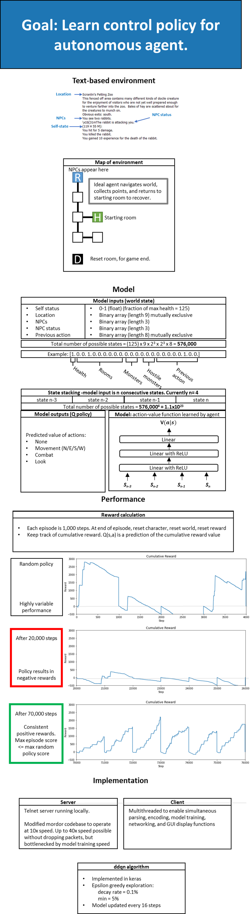

# deep_in_mud

deep_in_mud is a project demonstrating reinforcement learning for text-based environments. The project is based off of Deepmind's Atari demonstration. [link to repository](https://github.com/adrad/adrad.github.io/)

Mnih, V., Kavukcuoglu, K., Silver, D., Graves, A., Antonoglou, I., Wierstra, D., & Riedmiller, M. (2013). Playing atari with deep reinforcement learning. arXiv preprint arXiv:1312.5602

## Setup 

One of the fastest ways to get setup is to use conda, and to load the conda environment alphamud.yml. You may need to re-isntall tensorflow for a version optimized for your particular cpu/gpu setup. 

## Usage 

1. To run the environment server, use /mordor/bin/f_100ms_mordord.exe. This is a modified version of the original mordor server, made to run at 10x speed. See source in /fmordor
2. To run the ddqn agent client, use /robot/ddqn_agent_100ms/robot_threaded_model_ddqn.py
	a) This will open a client that can communicate with the server, and has the ddqn agent built in. 
	b) You will immediately be logged in. Press Start Bot to start training. Training will continue on its own, and requires some patience. 
	c) Each episode lasts for 1,000 steps. At the end of the 1,000 steps the character adn environment reset
	d) At the end of every episode, the epsilon parameter plot (exploration parameter), and the reward curve will update

	If crashing on startup, make sure the environment server is running correctly. 
   
3. If you are interested in creating more complex environments, check out the environment documentation in /mordor. Feel free to post any questions and comments. 

## Overview and current performance: 

